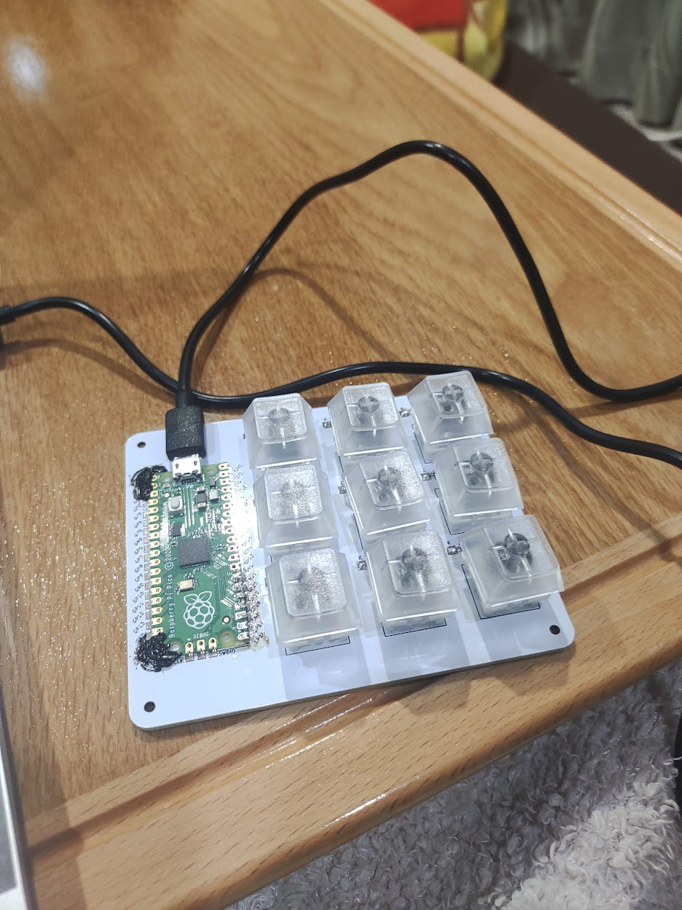
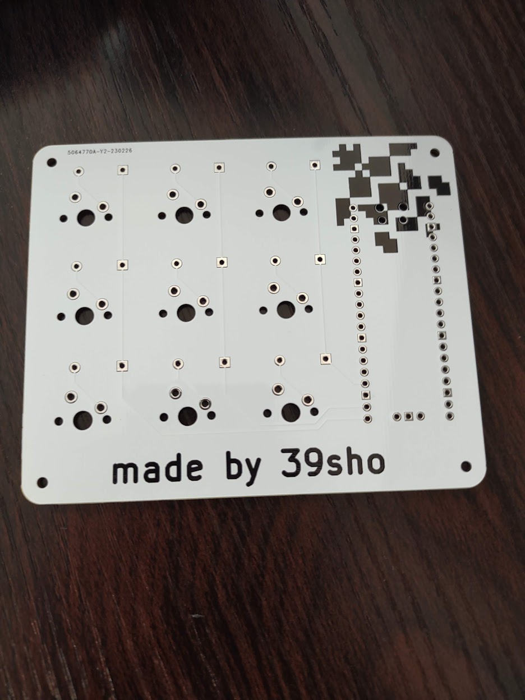
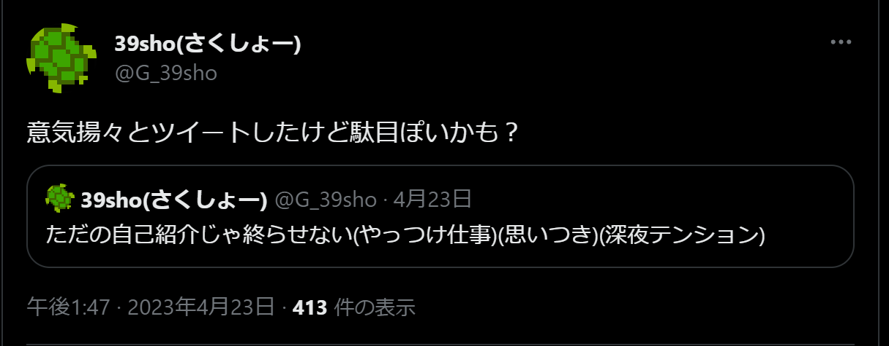
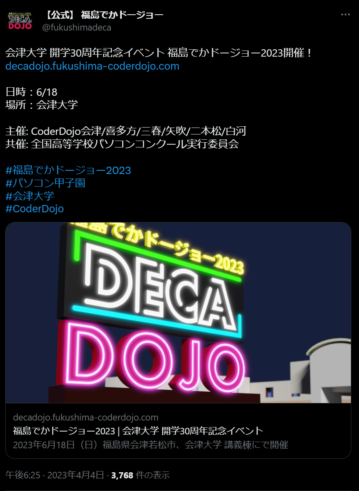

# 自己紹介@新歓LT
s1310225 作山 祥太
39sho(さくしょー)

---

## 目次

1. 基本情報
    1. 好きな音楽について
2. 最近やったこと
3. 意気揚々とツイートした件
    1. 何をしようとしたか
4. 宣伝

---

## 基本情報

- 名前: 39sho(さくしょー)
    - 本名(覚えなくていい): 作山 祥太
- 年齢: 19
    - 高校進級できなかっただけ
    - 中学さぼりまくって高校一年で留年
- 好きなもの: 音楽、激辛、料理(最近やってない)

---

- CoderDojo Aizu行きます
- 興味のある分野: ドライバー、ファームウェア
    - 飽きっぽいので...
- 書けるかもしれない言語: JavaScript

---

### 好きな音楽について

- 聞く専門
- アーティスト
    - ORESAMA
    - 有形ランペイジ
    - DUSTCELL
    - Dios
    - ...

---

## 最近やったこと

---

---

---

---

---

---

## 意気揚々とツイートした件

---

### 何をしようとしたか

- CommentScreen~~のパクリ~~を作ろうとしました。
- 家では動いた。
- 会津大学のネットワークでは動かない(セパレータか？)
- どっかにデプロイしろっていうのはそう。
- 早くクレカ作らないと...

---

## 宣伝

